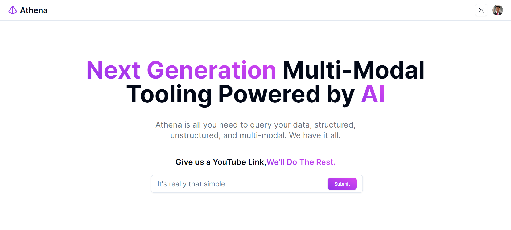

# TreeHacks 2024 🌲

Our project submission for TreeHacks 2024, the 10th anniversary of TreeHacks, the annual hackathon at Stanford University.

## Inspiration

Have you ever had to watch a video for a class, but you didn't have time to watch the whole thing? Or maybe you just wanted to skip to the important parts? We've all been there. That's why we created Athena and Minerva, two AI-powered tools that help you get the most out of your educational videos.

The inspiration for our project, Athena, comes from our experience as students with busy lives. Often, it isn't easy to keep track of the vast amounts of media we encounter (Lectures, webinars, TedTalks, etc).

With Athena, people can have one AI-powered store for all their content, allowing them to save time slogging through hours of material in search of information.

Our aim is to enhance productivity and empower our users to explore, engage, and learn in a way that truly values their time.

## Demo

## What it does

Our project consists of two components.

- Athena, a full-stack Next.js application powered by Convex, Bun, and shadcn.
- Minerva, a FastAPI backend powered by Langchain, Together.ai, and OpenAI GPT-3.5 Turbo.

Athena allows you to ask questions to your documents. You can ask questions like "What is the main idea of this video?" or "What are the key points?" and Athena will give you a summary of the video. Athena uses natural language processing to understand your questions and provide you with the most relevant information.

Minerva allows you to search for specific topics within your documents. You can search for keywords like "calculus" or "quantum mechanics" and Minerva will show you the most relevant parts of the video.

In Athena, we empower our users to manage and query all forms of content. You have the flexibility to choose how you organize and interact with your material. Whether you prefer grouping content by course and using focused queries or rewatching lectures with a custom-trained chatbot at your fingertips, our application Athena has got you covered.

We allow users to either perform multimodal vectorized searches across all their documents, enhancing information accessibility, or explore a single document with more depth and nuance using a custom-trained LLm model. With Athena, the power of information is in your hands, and the choice is yours to make.

## Tech Stack

- Convex
- Bun
- Together.ai
- Next.js
- React
- Langchain
- shadcn/ui
- Clerk
- TypeScript
- OpenAI GPT-3.5 Turbo
- Tailwind CSS
- FastAPI
- Python
- Vercel
- YouTube Transcript Library
- Zod

## How we built it

We built our application using a multitude of services/frameworks/tools:
- React.js for the core client frontend
- TypeScript for robust typing and abstraction support
- Tailwind for a utility-first CSS framework
- ShadCN for animations and UI components
- Clerk for a seamless and drop-in OAuth provider 
- React-icons for drop-in pixel-perfect icons 
- NextJS for server-side rendering and enhanced SEO
- Convex for vector search over our database
- App-router for client-side navigation
- Convex for real-time server and end-to-end type safety

## Challenges We Ran Into

- Navigating new services and needing to read **a lot** of documentation -- since this was the first time any of us had used vector search with Convex, it took a lot of research and heads-down coding to get Athena working.
- Being __awake__ to work as a team -- since this hackathon is both **in-person** and **through the weekend**, we had many sleepless nights to ensure we can successfully produce Athena.

## Accomplishments that we're proud of

- Finishing our project and getting it working! We were honestly surprised at our progress this weekend and are super proud of our end product Athena. 
- Learning a ton of new technologies we would have never come across without Tree Hacks.
- Being able to code for at times 12-16 hours straight and still be having fun!

## What we learned

- Tools are tools for a reason! Embrace them, learn from them, and utilize them to make your applications better.
- Sometimes, more sleep is better -- as humans, sleep can sometimes be the basis for our mental ability!
- How to work together on a team project with many commits and iterate fast on our moving parts.

## What's next for Athena

- Create more options for users to group their content in different ways.
- Establish the ability for users to share content with others, increasing knowledge bases.
- Allow for more types of content upload apart from Videos and PDFs
